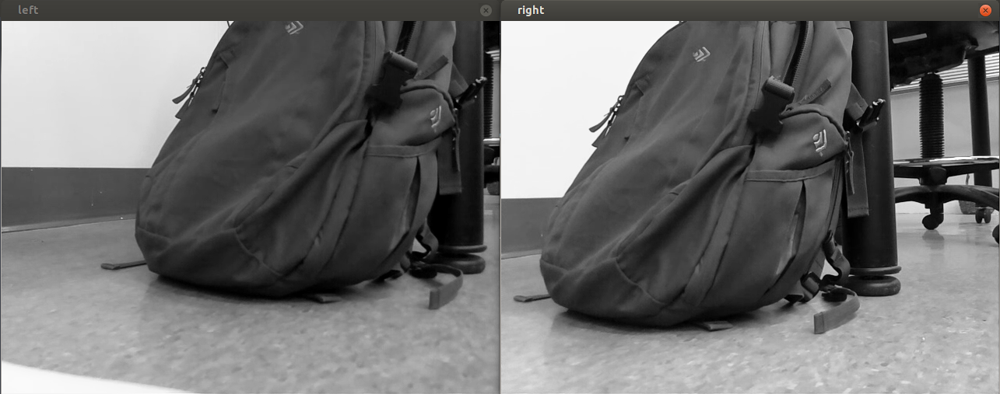
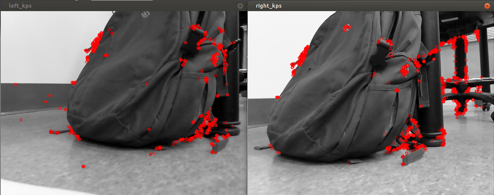
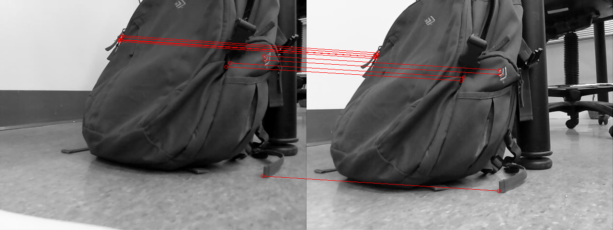
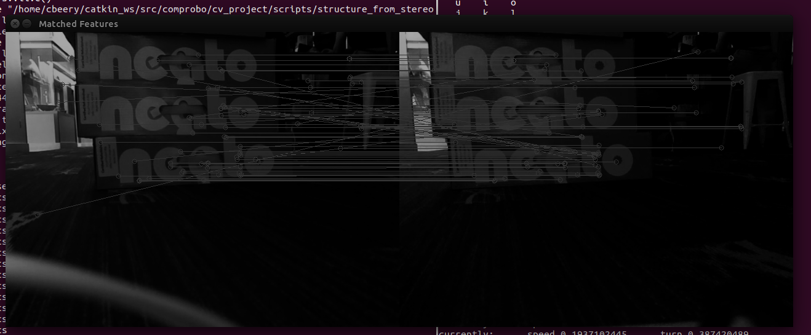

# 3D Computer Vision from Stereo Cameras

## Motivation
As a two-week project for Olin's Spring 2017 offering of Computational Robotics, our team of three implemented a well-documented code pipeline for making sense of 2D images from two stereoscopic cameras as a 3D point cloud.

In our implementation, we relied primarily upon chapter four of the book *Mastering OpenCV with Practical Computer Vision Projects*.

## Setup
### Software
This project was developed within the ROS framework, though individual parts - such as the key-point matching - are standalone libraries based on the OpenCV library. Edits were additionally made to a copy of the base comprobo Neato bringup.lauch and camera_parameters.yaml files to allow for multiple cameras and a new tf transform between cameras' view_zero and the Neato's base_link.

### Hardware
To capture the stereo images required for this project, we mounted two [Raspberry Pi cameras](https://cdn-shop.adafruit.com/1200x900/1367-07.jpg) within a stereo rig on top of a [Neato vacuum cleaner bot](https://heavyeditorial.files.wordpress.com/2015/03/neato-xv-signature-pro-pet-allergy-robot-vacuum-cleaner.jpg), we capture images from these two camera viewpoints, which are separated by 10 cm. These cameras were then calibrated using a [ROS stereo calibration tutorials](http://wiki.ros.org/camera_calibration/Tutorials/StereoCalibration).

## Code  

The ROS node that controls the point cloud generation pipeline can be found at `scripts/structure_from_stereo`. This could allows for either a pair of still images from each camera to be loaded from a file and process by calling the static function or live camera data to be used calling the live function. The static code creates one point cloud then continues publishing it to rviz. The live function makes a point cloud from the initial view then continues to add new views to the point cloud scene when the robot moves a minimum amount. The live code has the following pipeline.

1. Determine if robot has moved
2. Find the current image pair keypoints
3. Make the keypoints into a point cloud in the camera view frame (view_zero)
4. Transfer the view point cloud into the odom frame
5. Combine the cummulative scene point cloud with the current view point cloud
6. Publish the scene to rviz
7. Repeat.

### Key-Point Matching
Within `scripts/find_keypoints.py` we implement a pipeline to match key-points between two images captured by our stereo rig. Below, we have captured two simultaneous images of a backpack.

Applying OpenCV's [ORB key-point detection method](http://docs.opencv.org/3.0-beta/doc/py_tutorials/py_feature2d/py_orb/py_orb.html) on both images, we generate a list of key-points of interest. These key-points are shown for both images, below, in red.

Comparing key-points between the two images, we use [OpenCV's brute force matcher](http://docs.opencv.org/3.0-beta/doc/py_tutorials/py_feature2d/py_matcher/py_matcher.html) to determine the top 10 matches that look most alike.

A suitable alternative is a ratio test, which picks all matches that are more  alike than a threshold. We attempted this matching strategy as well. However, for our purposes - which required only a seven match minimum to construct a relation between the images - we found the ratio test to be less suitable, as it produced a greater number of false matches.

The result of our key-point matching, applied to the backpack, can be seen below.

### Verifying the Projection Matrix

### Triangulation

To identify depth in an image, we needed to use our stereo vision to triangulate points from the camera. Since all points in an image are essentially rays pointing out from the camera, we needed to find where the two rays intersected. Luckily, OpenCV has a `triangulatePoints` function to do this. With this, we can transform our lists of matching keypoints into a depth cloud.

In our code, the OpenCV triangulation function is encapsulated in its own file. The triangulation function requires numpy arrays full of floats, and returns an array of homologous coordinates. The encapsulation was designed to allow us to convert the input to the correct format, and restructure the homologous coordinates in to an 3D Ros `PointCloud`, without complicating the main loop.

In this example, we manually identified the black keypoints in this image, and a corresponding image from the other camera.

Once fed into the triangulation code, it said that the closer edge of the boxes was .89 meters away, and that the far corners were 1.4 meters away. Given this test, we were confident that the triangulation worked correctly on correctly matched keypoints.
### Combining Multiple Views

### Resultant Point-Clouds
The following show the resulting live camera matches found from the stereo camera setup as well as the point cloud they generate.

## Future Work
